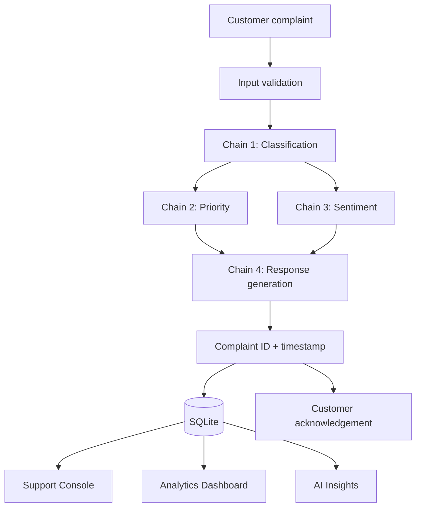

<p align="center">
  
</p>

<h1 align="center">AI-Powered FinTech Complaint Resolution System</h1>

<p align="center">
  Intelligent complaint management for financial services, built with <b>LangChain</b>, <b>GPT-4o Mini</b> and <b>Streamlit</b>.
</p>

<p align="center">
  
  
  
  
  
  
</p>

<p align="center">
  <b>Live Demo:</b> <a href="https://YOUR-APP-NAME.streamlit.app">https://YOUR-APP-NAME.streamlit.app</a> &nbsp;|&nbsp;
  <b>Repository:</b> <a href="https://github.com/YOUR-USERNAME/Complaint-Desk-FinTech">GitHub</a>
</p>

---

## 1. Project Overview

Financial institutions receive thousands of customer complaints every day - duplicate EMI deductions,
unauthorized transactions, refund delays, app crashes. Sorting and answering them manually is slow,
inconsistent and expensive.

This project automates the first line of support. A customer describes the problem in a chat window and the
system instantly:

1. **Classifies** the complaint (Billing, Loan, Fraud, App Issue) using an LLM,
2. **Assesses priority** (High / Medium / Low) and **customer sentiment** (Angry / Frustrated / Neutral / Positive),
3. **Generates a professional acknowledgement** in the voice of *XYZ Finance*,
4. **Assigns a unique complaint ID**, timestamps it and stores it,
5. Gives the support team a **console** to search, filter and update cases, and management an **analytics dashboard**.

## 2. Features

| Area | Feature |
|------|---------|
| Core AI | Complaint classification, AI acknowledgement (50-60 words), LangChain LCEL chains |
| Triage | Priority assessment and sentiment analysis for every complaint |
| Customer UX | Streamlit chat UI, conversation history, quick-example buttons, complaint tracking by ID |
| Tracking | Unique IDs (`CMP-2026-001`), timestamps, status workflow (Open / In Progress / Closed) |
| Support team | Search, filter by category / priority / status, update status, view sent reply |
| Management | KPI metrics, category / priority / sentiment charts, daily trend, CSV report export |
| AI Insights | Rule-based findings (e.g. "Fraud complaints increased by 15%") plus optional LLM summary |
| Reliability | Input validation, card-number masking, retry + timeout, automatic offline fallback |
| DevOps | Dockerfile, docker-compose, GitHub Actions CI, unit + UI tests |

## 3. Screenshots

| Customer Portal | Billing complaint |
|:---:|:---:|
|  |  |

| Fraud complaint (High priority) | Analytics dashboard |
|:---:|:---:|
|  |  |

## 4. Architecture

```
Customer Complaint
        │
        ▼
 Input Validation  (length checks, card-number masking)
        │
        ▼
 Chain 1 · Classification ──▶ billing | loan | fraud | app_issue
        │
        ├──────────────▶ Chain 2 · Priority Assessment ──▶ high | medium | low
        └──────────────▶ Chain 3 · Sentiment Analysis  ──▶ angry | frustrated | neutral | positive
                                   │
                                   ▼
 Chain 4 · Response Generation  (category + priority + sentiment + complaint)
        │
        ▼
 Complaint ID + Timestamp ──▶ SQLite storage
        │
        ▼
 Customer reply  ·  Support Console  ·  Analytics Dashboard  ·  AI Insights
```



If the LLM is unreachable (no key, outage, rate limit) the pipeline **falls back to a rule-based engine**, so a
complaint is never lost. The UI clearly labels which engine handled each complaint.

## 5. Technology Stack

| Layer | Technology |
|-------|-----------|
| Frontend | Streamlit (chat UI, charts) |
| AI framework | LangChain (LCEL: `prompt \| llm \| parser`) |
| LLM | OpenAI GPT-4o Mini (default); any OpenAI-compatible provider works, e.g. Groq's free Llama models |
| Language | Python 3.10+ |
| Storage | SQLite |
| Deployment | Streamlit Community Cloud, Docker, AWS EC2 |
| CI | GitHub Actions + pytest |

### Why `temperature = 0.3`?

Financial support needs **consistent, professional and reliable** language. A low temperature reduces
randomness, so similar complaints receive similar, predictable, business-friendly replies while still sounding
natural. It is configurable through `LLM_TEMPERATURE`.

## 6. Prompt Design

All prompts live in [`complaint_desk/prompts.py`](complaint_desk/prompts.py). Rules go in the *system* message
and the customer's text goes in the *human* message, with an explicit instruction to ignore instructions hidden
inside a complaint (prompt-injection defence).

**Classification prompt**

```text
You are a FinTech complaint classifier.
Classify the complaint into ONLY one category: billing, loan, fraud, app_issue
Return only the category name.
```

**Response prompt**

```text
You are a customer support executive at XYZ Finance.
Generate a professional acknowledgement.
- 50-60 words        - Polite tone
- Mention investigation and the support team
- Do not promise resolution
- Sign as XYZ Finance
```

LLM output is normalised (`" Loan. "` becomes `loan`); unparseable output triggers the rule-based fallback for
that step.

## 7. Installation

**Prerequisites:** Python 3.10+ and (optional) an OpenAI API key.

```bash
# 1. Clone and enter the project
git clone https://github.com/YOUR-USERNAME/Complaint-Desk-FinTech.git
cd Complaint-Desk-FinTech

# 2. Create a virtual environment
python -m venv .venv
source .venv/bin/activate          # Windows (PowerShell): .venv\Scripts\Activate.ps1
                                   # Windows (cmd):        .venv\Scripts\activate.bat

# 3. Install dependencies
pip install -r requirements.txt

# 4. Configure environment variables
cp .env.example .env               # Windows: copy .env.example .env
# open .env and set OPENAI_API_KEY=sk-...

# 5. Run the app
streamlit run app.py
```

Open <http://localhost:8501>. Without an API key the app starts in **offline demo mode** (rule-based engine).

### Load sample data (for a full-looking dashboard)

```bash
python scripts/seed_demo_data.py --reset
```

### Run the tests

```bash
pip install -r requirements-dev.txt
pytest -q
```

### Check your LLM connection

```bash
python scripts/check_llm.py                 # sends a test message and a sample complaint
python scripts/check_llm.py --list-models   # lists the models your key can use
```

### Free alternative: Groq (no OpenAI credit needed)

The pipeline uses LangChain's OpenAI-compatible client, so the LLM provider is just configuration.
The project is designed for **GPT-4o Mini**, but it also runs on Groq's free tier. In `.env`:

```dotenv
OPENAI_API_KEY=gsk_your_groq_key
OPENAI_BASE_URL=https://api.groq.com/openai/v1
OPENAI_MODEL=openai/gpt-oss-20b
```

Keep exactly one line per setting in `.env` (a duplicated name is overridden by the last line).

### Run a local model with Ollama (Activity B)

The provider is chosen in one place, `build_llm()` in `complaint_desk/chains.py`. Swapping the hosted API for a
local model is a one-line change:

```diff
- llm = ChatOpenAI(model="openai/gpt-oss-20b", temperature=0.3, base_url="https://api.groq.com/openai/v1")
+ llm = ChatOllama(model="mistral", temperature=0.3)
```

Without touching the code, set this in `.env`:

```dotenv
LLM_PROVIDER=ollama
OLLAMA_MODEL=mistral
```

Then install Ollama from <https://ollama.com>, download the model once and start the app:

```bash
ollama pull mistral
python scripts/check_llm.py      # should end with "All good"
streamlit run app.py
```

### Benchmark: hosted API vs local Ollama

`scripts/benchmark_llms.py` runs the same 10 frozen test complaints (with gold labels) through both back-ends and
measures triage accuracy, reply quality (7 automatic checks), latency, token usage and cost per 1,000 requests.

```bash
python scripts/benchmark_llms.py --hardware "Ryzen 5, 16 GB RAM, no GPU"
```

It writes `reports/ACTIVITY_B_COMPARISON.html` (open it and use **Print -> Save as PDF** for the one-page
comparison), plus a Markdown version and a per-complaint appendix. Prices are assumptions you can override with
`--price-in`, `--price-out` and `--server-monthly-usd`.

### Configuration

| Variable | Default | Description |
|----------|---------|-------------|
| `OPENAI_API_KEY` | *(empty)* | Enables AI mode |
| `OPENAI_BASE_URL` | *(empty)* | Optional. Use any OpenAI-compatible API, e.g. `https://api.groq.com/openai/v1` |
| `LLM_PROVIDER` | `openai` | `openai` (any OpenAI-compatible API) or `ollama` (local model) |
| `OPENAI_MODEL` | `gpt-4o-mini` | Chat model for the hosted API |
| `OLLAMA_MODEL` | `mistral` | Local model used when `LLM_PROVIDER=ollama` |
| `OLLAMA_BASE_URL` | `http://localhost:11434` | Where Ollama is running |
| `LLM_TEMPERATURE` | `0.3` | Sampling temperature |
| `COMPANY_NAME` | `XYZ Finance` | Branding used in replies and UI |
| `DB_PATH` | `data/complaints.db` | SQLite file |
| `SUPPORT_PIN` | *(empty)* | Optional PIN for the Support Console |
| `OFFLINE_MODE` | `false` | Force the rule-based engine |

## 8. Deployment

### Streamlit Community Cloud

1. Push this repository to GitHub.
2. Go to <https://share.streamlit.io> and click **New app**; choose the repo, branch `main`, file `app.py`.
3. Open **Advanced settings → Secrets** and paste:
   ```toml
   OPENAI_API_KEY = "sk-..."
   # For Groq also add:
   # OPENAI_BASE_URL = "https://api.groq.com/openai/v1"
   # OPENAI_MODEL = "openai/gpt-oss-20b"
   ```
4. Deploy, then copy the live URL into the top of this README.

> Community Cloud storage is ephemeral, so the SQLite file resets on redeploy. That is fine for a demo; use a
> managed database for production.

### Docker

```bash
docker build -t complaint-desk .
docker run -d --name complaint-desk -p 8501:8501 --env-file .env -v "$(pwd)/data:/app/data" complaint-desk
```

or with Compose:

```bash
docker compose up -d --build
```

### AWS EC2 (Ubuntu 22.04/24.04)

```bash
sudo apt update && sudo apt install -y docker.io git
sudo systemctl enable --now docker
sudo usermod -aG docker $USER && newgrp docker

git clone https://github.com/YOUR-USERNAME/Complaint-Desk-FinTech.git
cd Complaint-Desk-FinTech
cp .env.example .env && nano .env          # add OPENAI_API_KEY

docker build -t complaint-desk .
docker run -d --name complaint-desk --restart unless-stopped \
  -p 80:8501 --env-file .env -v "$(pwd)/data:/app/data" complaint-desk
```

Open port **80** in the instance's security group, then browse to `http://<EC2-PUBLIC-IP>`.

## 9. Project Structure

```
Complaint-Desk-FinTech/
├── app.py                     # Streamlit UI (4 pages)
├── complaint_desk/
│   ├── config.py              # settings and domain constants
│   ├── prompts.py             # all LangChain prompt templates
│   ├── chains.py              # LCEL pipeline, build_llm() provider switch, fallback logic
│   ├── benchmark.py           # test set, scoring and report rendering for Activity B
│   ├── fallback.py            # rule-based offline engine
│   ├── validators.py          # input validation, card masking
│   ├── storage.py             # SQLite store, complaint IDs
│   └── analytics.py           # metrics, trends, insights
├── scripts/seed_demo_data.py  # sample data generator
├── scripts/check_llm.py       # LLM connection check (hosted or Ollama)
├── scripts/benchmark_llms.py  # Activity B: hosted vs local comparison
├── reports/                   # benchmark output (one-page comparison)
├── tests/                     # unit + Streamlit UI tests
├── screenshots/               # README images
├── assets/logo.svg
├── .github/workflows/ci.yml   # CI (pytest)
├── .streamlit/config.toml     # theme
├── Dockerfile · docker-compose.yml
├── requirements.txt · requirements-dev.txt
├── .env.example · .gitignore · LICENSE
└── README.md
```

## 10. Evaluation Mapping

| Criterion | Weight | Where it is covered |
|-----------|:------:|---------------------|
| Functionality | 40% | Complaint input, automatic classification, AI response, conversation history, error handling and fallback |
| Prompt quality | 20% | Role-based, constrained prompts in `prompts.py`; output normalisation; injection defence |
| Clean repository | 20% | README, screenshots, architecture diagram, modular structure, tests, CI |
| Deployment | 20% | Streamlit Cloud, Docker (bonus), AWS EC2 (bonus) |

**Extra features:** complaint IDs, timestamps, statistics charts, CSV report, sidebar KPIs, priority and sentiment
analysis, support console, AI insights.

## 11. Security and Privacy Notes

- API keys stay in `.env` / Streamlit secrets and are never committed.
- Card-like numbers are masked before they reach the LLM or the database.
- CSV exports neutralise spreadsheet-formula injection.
- Prompts instruct the model to ignore instructions embedded in complaint text.
- The Support Console can be protected with `SUPPORT_PIN`.

## 12. Roadmap

- More categories (KYC, UPI payments, credit card, account closure)
- Authentication and roles for support agents
- Email / SMS notifications with the complaint ID
- PostgreSQL storage and SLA timers
- Multilingual complaints (Hindi, Kannada, Tamil)

---

**In one line:** *This project uses LangChain chains to automatically classify FinTech customer complaints,
assess priority and sentiment, and generate professional acknowledgements, reducing manual support effort and
improving customer service efficiency.*

Released under the [MIT License](LICENSE).
